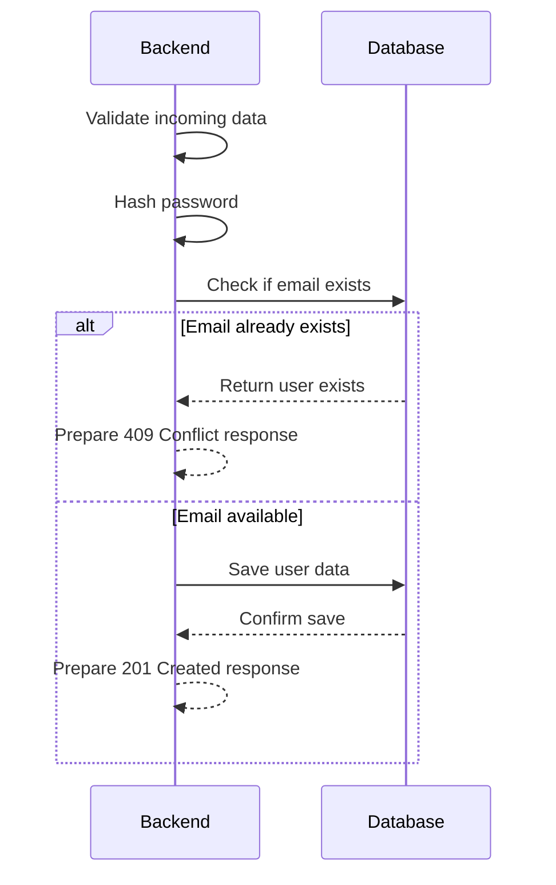

```mermaid
sequenceDiagram
    participant Backend
    participant Database

    Backend->>Backend: Validate incoming data
    Backend->>Backend: Hash password
    Backend->>Database: Check if email exists

    alt Email already exists
        Database-->>Backend: Return user exists
        Backend-->>Backend: Prepare 409 Conflict response
    else Email available
        Backend->>Database: Save user data
        Database-->>Backend: Confirm save
        Backend-->>Backend: Prepare 201 Created response
    end
```